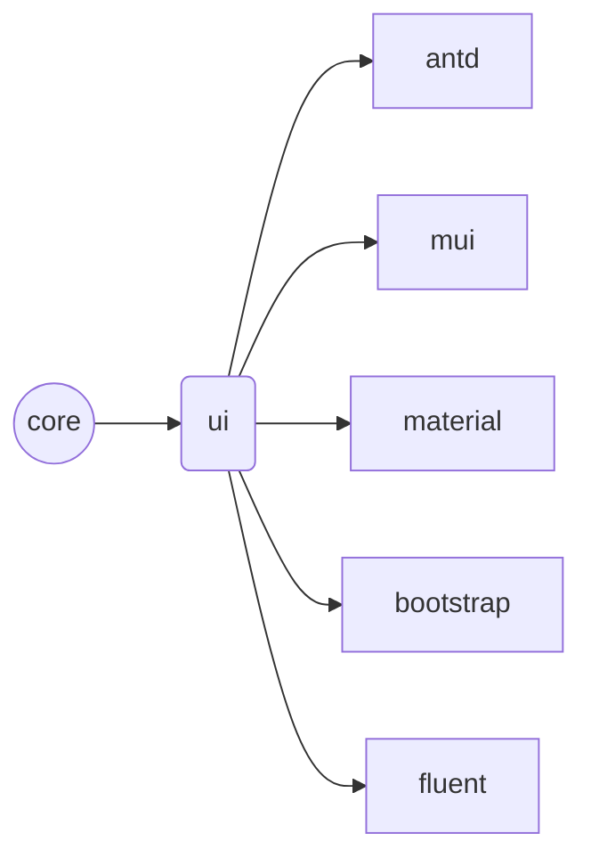

<p align="center">
  <a href="https://ukrbublik.github.io/react-awesome-query-builder/" rel="noopener" target="_blank"></a>
</p>
<! --
[](https://travis-ci.com/github/ukrbublik/react-awesome-query-builder) 
[](https://opencollective.com/react-awesome-query-builder)
-->

[](https://www.npmjs.com/package/@react-awesome-query-builder/ui)
[](https://github.com/ukrbublik/react-awesome-query-builder/actions/workflows/smoke.yml?query=branch%3Amaster)
[](https://codecov.io/gh/ukrbublik/react-awesome-query-builder)
[](https://ant.design)
[](https://mui.com)
[](https://reactstrap.github.io/)
[](https://developer.microsoft.com/en-us/fluentui)
[](https://ukrbublik.github.io/react-awesome-query-builder/)
[](https://codesandbox.io/s/github/ukrbublik/react-awesome-query-builder/tree/master/packages/sandbox?file=/src/demo/config.tsx)
[](https://codesandbox.io/s/github/ukrbublik/react-awesome-query-builder/tree/master/packages/sandbox_simple?file=/src/demo/config.jsx)


User-friendly React component to build queries (filters).

Inspired by [jQuery QueryBuilder](http://querybuilder.js.org/). 
Using awesome UI frameworks for widgets: [Ant Design](https://ant.design/), [Material-UI](https://mui.com/), [Bootstrap](https://reactstrap.github.io/). 
Now [Fluent UI](https://developer.microsoft.com/en-us/fluentui#/get-started/web) is also supported!

See [live demo](https://ukrbublik.github.io/react-awesome-query-builder) 

[](https://codesandbox.io/p/github/ukrbublik/react-awesome-query-builder/master?file=%2Fpackages%2Fexamples%2Fdemo%2Findex.tsx)


* [Features](#features)
* [Getting started](#getting-started)
* [Demo apps](#demo-apps)
* [Usage](#usage)
  * [Minimal JavaScript example with class component](#minimal-javascript-example-with-class-component)
  * [Minimal TypeScript example with function component](#minimal-typescript-example-with-function-component)
* [API](#api)
  * [Query](#query-)
  * [Builder](#builder-)
  * [Utils](#utils)
    * [Save/load tree](#saveload-tree)
    * [Validation](#validation-utils)
    * [Export](#export-utils)
    * [Import](#import-utils)
    * [Save/load config from server](#saveload-config-from-server)
  * [Config format](#config-format)
* [i18n](#i18n)
* [SSR](#ssr)
  * [ctx](#ctx)
* [Versions](#versions)
  * [Changelog](#changelog)
  * [Migration to 6.5.0](#migration-to-650)
  * [Migration to 6.4.0](#migration-to-640)
  * [Migration to 6.3.0](#migration-to-630)
  * [Migration to 6.2.0](#migration-to-620)
  * [Migration to 6.0.0](#migration-to-600)
  * [Migration to 5.2.0](#migration-to-520)
  * [Migration to 4.9.0](#migration-to-490)
  * [Migration from v1 to v2](#migration-from-v1-to-v2)
* [Contributing](#contributing)
  * [Code Contributing](#code-contributing)
  * [Financial Contributing](#financial-contributing)


### Features
[](https://ukrbublik.github.io/react-awesome-query-builder)
- Highly configurable
- Fields can be of type:
  - simple (string, number, bool, date/time/datetime, list)
  - structs (will be displayed in selectbox as tree)
  - custom type (dev should add its own widget component in config for this)
- Comparison operators can be:
  - binary (== != < > ..)
  - unary (is empty, is null)
  - 'between' (for numbers, dates, times)
  - complex operators like 'proximity'
- RHS can be:
  - values
  - another fields (of same type)
  - functions (arguments also can be values/fields/funcs)
- LHS can be field or function
- Reordering (drag-n-drop) support for rules and groups of rules
- Themes:
  - [Ant Design](https://ant.design/)
  - [Material-UI](https://mui.com/)
  - [Bootstrap](https://reactstrap.github.io/)
  - [Fluent UI](https://developer.microsoft.com/en-us/fluentui)
  - vanilla
  (Using another UI framework and custom widgets is possible, see below)
- Export to MongoDb, SQL, [JsonLogic](http://jsonlogic.com), [SpEL](https://docs.spring.io/spring-framework/docs/3.2.x/spring-framework-reference/html/expressions.html), ElasticSearch or your custom format
- Import from [JsonLogic](http://jsonlogic.com), [SpEL](https://docs.spring.io/spring-framework/docs/3.2.x/spring-framework-reference/html/expressions.html)
- TypeScript support (see [types](/packages/core/modules/index.d.ts) and [demo in TS](/packages/examples))
- Query value and config can be saved/loaded from server


## Getting started
From v6 library is divided into packages:
- [`@react-awesome-query-builder/core`](/packages/core) - has core functionality to import/export/store query, provides utils
- [`@react-awesome-query-builder/ui`](/packages/ui) - has core React components like `<Query>` `<Builder>` and CSS, provides config with basic (vanilla) widgets
- [`@react-awesome-query-builder/antd`](/packages/antd) - provides config with [Ant Design](https://ant.design/) widgets
- [`@react-awesome-query-builder/mui`](/packages/mui) - provides config with [MUI](https://mui.com/) widgets
- [`@react-awesome-query-builder/material`](/packages/material) - provides config with [Material-UI v4](https://v4.mui.com/) widgets (deprecated)
- [`@react-awesome-query-builder/bootstrap`](/packages/bootstrap) - provides config with [Bootstrap](https://reactstrap.github.io/) widgets
- [`@react-awesome-query-builder/fluent`](/packages/fluent) - provides config with [Fluent UI](https://developer.microsoft.com/en-us/fluentui) widgets



`ui` re-exports from `core`, other packages re-export from `ui`. 
For using this library on frontend you need to install and use only `ui` (for basic widgets) or one of framework-specific packages (`antd` / `mui` / `bootstrap` / `fluent`). 

For using this library on server-side (Node.js) you need only `core`. 
This is useful if you want to pass query value from frontend to backend in JSON format and perform [export](#export-utils) eg. to SQL on server-side for security reasons.

Example of installation if you use [MUI](https://mui.com/):
```
npm i @react-awesome-query-builder/mui --save
```

Note: We use [pnpm](https://pnpm.io/). If you want to clone this project and run scripts, please [install pnpm](https://pnpm.io/installation):
```
npm install -g pnpm
```


See [basic usage](#usage) for minimum code example. 

See [API](#api) and [config](#config-format) for documentation. 


## Demo apps

- [`pnpm start`](/packages/examples) - demo app with hot reload of demo code and local library code, uses TS, uses complex config to demonstrate anvanced usage, uses all supported UI frameworks.
- [`pnpm sandbox-ts`](/packages/sandbox) - simple demo app, built with Vite, uses TS, uses MUI widgets.
- [`pnpm sandbox-js`](/packages/sandbox_simple) - simplest demo app, built with Vite, not uses TS, uses vanilla widgets.
- [`pnpm sandbox-next`](/packages/sandbox_next) - advanced demo app with server side, built with Next.js, uses TS, uses MUI widgets, has API to save/load query value and query config from storage.


## Usage

#### Minimal JavaScript example with class component
```javascript
import React, {Component} from 'react';

// >>>
import { Utils as QbUtils, Query, Builder, BasicConfig } from '@react-awesome-query-builder/ui';
import '@react-awesome-query-builder/ui/css/styles.css';
// or import '@react-awesome-query-builder/ui/css/compact_styles.css';
const InitialConfig = BasicConfig;
// <<<

// You need to provide your own config. See below 'Config format'
const config = {
  ...InitialConfig,
  fields: {
    qty: {
      label: 'Qty',
      type: 'number',
      fieldSettings: {
        min: 0,
      },
      valueSources: ['value'],
      preferWidgets: ['number'],
    },
    price: {
      label: 'Price',
      type: 'number',
      valueSources: ['value'],
      fieldSettings: {
        min: 10,
        max: 100,
      },
      preferWidgets: ['slider', 'rangeslider'],
    },
    name: {
      label: 'Name',
      type: 'text',
    },
    color: {
      label: 'Color',
      type: 'select',
      valueSources: ['value'],
      fieldSettings: {
        listValues: [
          { value: 'yellow', title: 'Yellow' },
          { value: 'green', title: 'Green' },
          { value: 'orange', title: 'Orange' }
        ],
      }
    },
    is_promotion: {
      label: 'Promo?',
      type: 'boolean',
      operators: ['equal'],
      valueSources: ['value'],
    },
  }
};

// You can load query value from your backend storage (for saving see `Query.onChange()`)
const queryValue = {"id": QbUtils.uuid(), "type": "group"};


class DemoQueryBuilder extends Component {
  state = {
    tree: QbUtils.loadTree(queryValue),
    config: config
  };
  
  render = () => (
    <div>
      <Query
        {...config} 
        value={this.state.tree}
        onChange={this.onChange}
        renderBuilder={this.renderBuilder}
      />
      {this.renderResult(this.state)}
    </div>
  )

  renderBuilder = (props) => (
    <div className="query-builder-container" style={{padding: '10px'}}>
      <div className="query-builder qb-lite">
        <Builder {...props} />
      </div>
    </div>
  )

  renderResult = ({tree: immutableTree, config}) => (
    <div className="query-builder-result">
      <div>Query string: <pre>{JSON.stringify(QbUtils.queryString(immutableTree, config))}</pre></div>
      <div>MongoDb query: <pre>{JSON.stringify(QbUtils.mongodbFormat(immutableTree, config))}</pre></div>
      <div>SQL where: <pre>{JSON.stringify(QbUtils.sqlFormat(immutableTree, config))}</pre></div>
      <div>JsonLogic: <pre>{JSON.stringify(QbUtils.jsonLogicFormat(immutableTree, config))}</pre></div>
    </div>
  )
  
  onChange = (immutableTree, config) => {
    // Tip: for better performance you can apply `throttle` - see `examples/demo`
    this.setState({tree: immutableTree, config: config});

    const jsonTree = QbUtils.getTree(immutableTree);
    console.log(jsonTree);
    // `jsonTree` can be saved to backend, and later loaded to `queryValue`
  }
}
export default DemoQueryBuilder;
```

#### Minimal TypeScript example with function component
```typescript
import React, { useState, useCallback } from "react";

// >>> 
import type { JsonGroup, Config, ImmutableTree, BuilderProps } from '@react-awesome-query-builder/ui';
import { Utils as QbUtils, Query, Builder, BasicConfig } from '@react-awesome-query-builder/ui';
import '@react-awesome-query-builder/ui/css/styles.css';
// or import '@react-awesome-query-builder/ui/css/compact_styles.css';
const InitialConfig = BasicConfig;
// <<<

// You need to provide your own config. See below 'Config format'
const config: Config = {
  ...InitialConfig,
  fields: {
    qty: {
      label: "Qty",
      type: "number",
      fieldSettings: {
        min: 0
      },
      valueSources: ["value"],
      preferWidgets: ["number"]
    },
    price: {
      label: "Price",
      type: "number",
      valueSources: ["value"],
      fieldSettings: {
        min: 10,
        max: 100
      },
      preferWidgets: ["slider", "rangeslider"]
    },
    name: {
      label: 'Name',
      type: 'text',
    },
    color: {
      label: "Color",
      type: "select",
      valueSources: ["value"],
      fieldSettings: {
        listValues: [
          { value: "yellow", title: "Yellow" },
          { value: "green", title: "Green" },
          { value: "orange", title: "Orange" }
        ]
      }
    },
    is_promotion: {
      label: "Promo?",
      type: "boolean",
      operators: ["equal"],
      valueSources: ["value"]
    }
  }
};

// You can load query value from your backend storage (for saving see `Query.onChange()`)
const queryValue: JsonGroup = { id: QbUtils.uuid(), type: "group" };

const DemoQueryBuilder: React.FC = () => {
  const [state, setState] = useState({
    tree: QbUtils.loadTree(queryValue),
    config: config
  });

  const onChange = useCallback((immutableTree: ImmutableTree, config: Config) => {
    // Tip: for better performance you can apply `throttle` - see `examples/demo`
    setState(prevState => ({ ...prevState, tree: immutableTree, config: config }));

    const jsonTree = QbUtils.getTree(immutableTree);
    console.log(jsonTree);
    // `jsonTree` can be saved to backend, and later loaded to `queryValue`
  }, []);

  const renderBuilder = useCallback((props: BuilderProps) => (
    <div className="query-builder-container" style={{ padding: "10px" }}>
      <div className="query-builder qb-lite">
        <Builder {...props} />
      </div>
    </div>
  ), []);

  return (
    <div>
      <Query
        {...config}
        value={state.tree}
        onChange={onChange}
        renderBuilder={renderBuilder}
      />
      <div className="query-builder-result">
        <div>
          Query string:{" "}
          <pre>
            {JSON.stringify(QbUtils.queryString(state.tree, state.config))}
          </pre>
        </div>
        <div>
          MongoDb query:{" "}
          <pre>
            {JSON.stringify(QbUtils.mongodbFormat(state.tree, state.config))}
          </pre>
        </div>
        <div>
          SQL where:{" "}
          <pre>
            {JSON.stringify(QbUtils.sqlFormat(state.tree, state.config))}
          </pre>
        </div>
        <div>
          JsonLogic:{" "}
          <pre>
            {JSON.stringify(QbUtils.jsonLogicFormat(state.tree, state.config))}
          </pre>
        </div>
      </div>
    </div>
  );
};
export default DemoQueryBuilder;
```


# API

## `<Query />`
Props:
- `{...config}` - destructured [`CONFIG`](/CONFIG.adoc)
- `value` - query value in internal [Immutable](https://immutable-js.github.io/immutable-js/) format
- `onChange` - callback called when query value changes. Params: `value` (in Immutable format), `config`, `actionMeta` (details about action which led to the change, see `ActionMeta` in [`index.d.ts`](/packages/core/modules/index.d.ts)), `actions` (you can use to run actions programmatically, see `Actions` in [`index.d.ts`](/packages/core/modules/index.d.ts)).
- `onInit` - callback called before initial render, has same arguments as `onChange` (but `actionMeta` is undefined)
- `renderBuilder` - function to render query builder itself. Takes 1 param `props` you need to pass into `<Builder {...props} />`.

*Notes*:
- Please apply `useCallback` for `onChange` and `renderBuilder` for performance reason
- If you put query builder component inside [Material-UI](https://github.com/mui-org/material-ui)'s `<Dialog />` or `<Popover />`, please:
  - use prop `disableEnforceFocus={true}` for dialog or popver
  - set css `.MuiPopover-root, .MuiDialog-root { z-index: 900 !important; }` (or 1000 for AntDesign v3)
- If you put query builder component inside [Fluent-UI](https://developer.microsoft.com/en-us/fluentui)'s `<Panel />`, please:
  - set css `.ms-Layer.ms-Layer--fixed.root-119 { z-index: 900 !important; }`
- `props` arg in `renderBuilder` have `actions` and `dispatch` you can use to run actions programmatically
- For a list of available actions see `Actions` interface in [`index.d.ts`](/packages/core/modules/index.d.ts). See `runActions()` in [examples](/packages/examples/demo/index.tsx) as a demonstration of calling actions programmatically.

## `<Builder />`

Render this component only inside `Query.renderBuilder()` like in example above:
```js
  renderBuilder = (props) => (
    <div className="query-builder-container">
      <div className="query-builder qb-lite">
          <Builder {...props} />
      </div>
    </div>
  )
```

Wrapping `<Builder />` in `div.query-builder` is necessary.  
Optionally you can add class `.qb-lite` to it for showing action buttons (like delete rule/group, add, etc.) only on hover, which will look cleaner.  
Wrapping in `div.query-builder-container` is necessary if you put query builder inside scrollable block.  

## `Utils`

### Save/load tree

  #### `getTree`
  `Utils.getTree (immutableValue, light = true, children1AsArray = true) -> Object`  
  Convert query value from internal Immutable format to JS object.  
  You can use it to save value on backend in `onChange` callback of `<Query>`.  
  Tip: Use `light = false` in case if you want to store query value in your state in JS format and pass it as `value` of `<Query>` after applying `loadTree()` (which is not recommended because of double conversion). See issue [#190](https://github.com/ukrbublik/react-awesome-query-builder/issues/190)

  #### `loadTree`
  `Utils.loadTree (jsValue) -> Immutable`  
  Convert query value from JS format to internal Immutable format.  
  You can use it to load saved value from backend and pass as `value` prop to `<Query>`.

### Validation utils

  #### `isValidTree`
  `Utils.isValidTree (immutableValue, config) -> Boolean`  
  If `showErrorMessage` in config.settings is true, use this method to check if query has validation errors (presented in UI with red text color under the rule).  
  Note that incomplete rules or empty groups are not counted as validation errors for this function.  
  If `showErrorMessage` is false, this function will always return true.

### `validateTree`
  `Utils.validateTree (immutableValue, config, options?) -> Array`  
  Validates immutable query value to check it corresponds to the config and has no parts that are invalid or incomplete.  
  Returns array of errors grouped by item in tree.
  Each array element is `{ path, errors, itemStr, itemPositionStr }` (see type [`ValidationItemErrors`](/packages/core/modules/index.d.ts)).  
  To present item for user you can use `itemStr` (string representation of rule eg. `Number > 55`) and `itemPositionStr` (eg. `Rule #4 (index path: 1, 2)`).  
  Also you can use `path` to get raw item data with `Utils.TreeUtils.getItemByPath(tree, path)`.  
  `errors` is an array of objects `{ str, key, args }` (see type [`ValidationError`](/packages/core/modules/index.d.ts)).  
  `str` is an error message translated with [i18next.t(key, args)](https://www.i18next.com/overview/api#t) (namespace is `raqbvalidation`).  
  You can override/extend translations with:
  `Utils.i18n.addResources("en", "raqbvalidation", { ...yourTranslations })`.  
  See default [validation translations](/packages/core/modules/i18n/validation/translations.js).  
  See [i18n](#i18n).

  #### `sanitizeTree`
  `Utils.sanitizeTree (immutableValue, config, options?) -> { fixedTree, fixedErrors, nonFixedErrors }`  
  Validates and modifies immutable query value to ensure it corresponds to the config and has no parts that are invalid or incomplete.  
  Invalid rules (eg. if field is not found in config) will be always deleted.  
  Invalid values (eg. value > max or < min, value not passing `validateValue()` in field config) will be either:
   - always deleted if `showErrorMessage` in config.settings is false
   - marked with error if `showErrorMessage` is true
   - fixed (if possible) or deleted (if can't fix) if `options.forceFix` is true.

  `options` is an object with keys:
    - `removeEmptyGroups` (default: true) - If group has no children, drop it.
    - `removeIncompleteRules` (default: true) - If rule is not completed (eg. value in RHS is empty, or required argument for a function is empty), drop it. Cause it can't be exported (will not be present in result of any [export](#export-utils) function call) so can be treated as useless.
    - `forceFix` (default: false) - If a rule has validation error(s), fix them if it's possible (eg. if value > max, can be reset to max) otherwise drop it.

  Returns an object with properties: `fixedTree` (fixed immutable tree value), `fixedErrors`, `nonFixedErrors`.  
  `fixedErrors` is an array of fixed errors grouped by item (format is the same as returned from [validateTree](#validateTree)).  
  There can be `nonFixedErrors` if `fixedTree` still has validation errors (eg. if `forceFix: false` and there are rules with value > max, or `removeEmptyGroups: false` and there are empty groups).  


### Export utils

  #### `queryString`
  `Utils.Export.queryString (immutableValue, config, isForDisplay = false) -> String`  
  Convert query value to custom string representation.  
  `isForDisplay` = true can be used to make string more "human readable".

  #### `mongodbFormat`
  `Utils.Export.mongodbFormat (immutableValue, config) -> Object`  
  Convert query value to MongoDb query object.

  #### `sqlFormat`
  `Utils.Export.sqlFormat (immutableValue, config) -> String`  
  Convert query value to SQL where string.

  #### `spelFormat`
  `Utils.Export.spelFormat (immutableValue, config) -> String`  
  Convert query value to [Spring Expression Language (SpEL)](https://docs.spring.io/spring-framework/docs/3.2.x/spring-framework-reference/html/expressions.html).

  #### `elasticSearchFormat`
  `Utils.Export.elasticSearchFormat (immutableValue, config) -> Object`  
  Convert query value to ElasticSearch query object.

  #### `jsonLogicFormat`
  `Utils.Export.jsonLogicFormat (immutableValue, config) -> {logic, data, errors}`  
  Convert query value to [JsonLogic](http://jsonlogic.com) format.  
  If there are no `errors`, `logic` will be rule object and `data` will contain all used fields with null values ("template" data).

### Import utils

  #### `loadFromJsonLogic`
  `Utils.Import.loadFromJsonLogic (jsonLogicObject, config) -> Immutable`  
  Convert query value from [JsonLogic](http://jsonlogic.com) format to internal Immutable format.
 
  #### `_loadFromJsonLogic`
  `Utils.Import._loadFromJsonLogic (jsonLogicObject, config) -> [Immutable, errors]`

  #### `loadFromSpel`
  `Utils.Import.loadFromSpel (string, config) -> [Immutable, errors]`  
  Convert query value from [Spring Expression Language (SpEL)](https://docs.spring.io/spring-framework/docs/3.2.x/spring-framework-reference/html/expressions.html) format to internal Immutable format. 

### Save/load config from server

  #### `compressConfig`
  `Utils.ConfigUtils.compressConfig (config, baseConfig) -> ZipConfig`  
  Returns compressed config that can be serialized to JSON and saved on server.  
  `ZipConfig` is a special format that contains only changes agains `baseConfig`.  
  `baseConfig` is a config you used as a base for constructing `config`, like `InitialConfig` in examples above.  
  It depends on UI framework you choose - eg. if you use `@react-awesome-query-builder/mui`, please provide `MuiConfig` to `baseConfig`. 

  #### `decompressConfig`
  `Utils.ConfigUtils.decompressConfig (zipConfig, baseConfig, ctx?) -> Config`  
  Converts `zipConfig` (compressed config you receive from server) to a full config that can be passed to `<Query />`.  
  `baseConfig` is a config to be used as a base for constructing your config, like `InitialConfig` in examples above.  
  [`ctx`](#ctx) is optional and can contain your custom functions and custom React components used in your config.  
  If `ctx` is provided in 3rd argument, it will inject it to result config, otherwise will copy from basic config in 2nd argument.  
  See [SSR](#ssr) for more info.  
  Note that you should set `config.settings.useConfigCompress = true` in order for this function to work. 


## Config format
This library uses config-driven aproach. 
Config defines what value types, operators are supported, how they are rendered, imported, exported. 
At minimum, you need to provide your own set of fields as in [basic usage](#usage).  
See [`CONFIG`](/CONFIG.adoc) for full documentation.


## i18n
:construction:

This library uses [i18next](https://www.i18next.com/overview/getting-started) for translations.  

- Validation.
  Namespace: `raqbvalidation`.
  [Default translations resource](/packages/core/modules/i18n/validation/translations.js)

Example of overriding translations for validation error messages:
```js
Utils.i18n.addResources("en", "raqbvalidation", {
  "INCOMPLETE_LHS": "Incomplete left-hand side",
  "INCOMPLETE_RHS": "Incomplete right-hand side",
});
```

Example of using custom translations in `validateValue` in config:
```js
Utils.i18n.addResources("en", "mynamespace", {
  "INVALID_SLIDER_VALUE": "Invalid slider value {{val}}",
});

const config = {
  ...MuiConfig,
  fields: {
    slider: {
      type: "number",
      preferWidgets: ["slider"],
      fieldSettings: {
        validateValue: (val) => {
          return (val < 50 ? null : {
            error: {
              // use `key` and `args` for i18next.t()
              // `key` should have your namespace prefixed with ":"
              key: "mynamespace:INVALID_SLIDER_VALUE",
              args: { val }
            },
            fixedValue: 49
          });
        },
      }
    }
  }
};

// then use <Query {...config} />
```

See [example](/packages/examples/demo/index.tsx).


## SSR
You can save and load config from server with help of utils:
- [Utils.compressConfig()](#compressconfig)
- [Utils.decompressConfig()](#decompressconfig)

You need these utils because you can't just send config *as-is* to server, as it contains functions that can't be serialized to JSON.  
Note that you need to set `config.settings.useConfigCompress = true` to enable this feature.  

To put it simple:
- `ZipConfig` type is a JSON that contains only changes against basic config (differences). At minimum it contains your `fields`. It does not contain [`ctx`](#ctx).
- `Utils.decompressConfig()` will merge `ZipConfig` to basic config (and add `ctx` if passed). 

See [sandbox_next demo app](/packages/sandbox_next) that demonstrates server-side features. 

### ctx
Config context is an obligatory part of config starting from version 6.3.0  
It is a collection of functions and React components to be used in other parts of config by reference to `ctx` rather than by reference to imported modules.  
The purpose of `ctx` is to isolate non-serializable part of config.  
See [config.ctx](/CONFIG.adoc#configctx).  


## Versions

Version 5 is backward-compatible with 2-4. 
From version 6 library is divided into [packages](/packages). 
It's recommended to update your version to 6.x. You just need to change your imports, see [Migration to 6.0.0](#migration-to-600)

### Supported versions
| Version | Supported          |
| ------- | ------------------ |
| 6.x     | :white_check_mark: |
| 5.x     | :heavy_check_mark: |
| 4.x     | :warning:          |
| 3.x     | :x:                |
| 2.x     | :x:                |
| 1.x     | :x:                |
| 0.x     | :x:                |

### Changelog
See [`CHANGELOG`](/CHANGELOG.md)

### Migration to 6.5.0

Validation API has been changed:
- `Utils.validateTree()` now returns array of validation errors intead of boolean
- `Utils.checkTree()` and `Utils.validateAndFixTree()` are deprecated (and removed type defs). Use `Utils.sanitizeTree().fixedTree` instead

### Migration to 6.4.0

If you want to enable functions in LHS, please add to `config.settings`:
```js
fieldSources: ["field", "func"],
```

### Migration to 6.3.0

Now config has new [`ctx`](#ctx) property. Make sure you add it to your config.

Typically you just need to copy it from basic config.
So if you create config like this, you don't need to make any changes:
```js
import { MuiConfig } from "@react-awesome-query-builder/mui";
const config = {
  ...MuiConfig,
  fields: {
    // your fields
  },
};
```

But if you create config without destructuring of basic config, please add `ctx`:
```js
import { MuiConfig } from "@react-awesome-query-builder/mui";

const config = {
  ctx: MuiConfig.ctx, // needs to be added for 6.3.0+
  conjunctions,
  operators,
  widgets,
  types,
  settings,
  fields,
  funcs
};
export default config;
```

### Migration to 6.2.0

If you use `treeselect` or `treemultiselect` type (for AntDesign), please rename `listValues` to `treeValues`

### Migration to 6.0.0

From version 6 library is divided into [packages](/packages). 
Please remove package `react-awesome-query-builder` and install one of:
- [`@react-awesome-query-builder/ui`](/packages/ui)
- [`@react-awesome-query-builder/antd`](/packages/antd)
- [`@react-awesome-query-builder/bootstrap`](/packages/bootstrap)
- [`@react-awesome-query-builder/mui`](/packages/mui)
- [`@react-awesome-query-builder/material`](/packages/material) (deprecated)
- [`@react-awesome-query-builder/fluent`](/packages/fluent)

Library code is backward-compatible with version 2-5. 
You just need to change your imports. 

```diff
- import { Utils, Export, Import, BasicFuncs } from 'react-awesome-query-builder';
+ import { Utils, Export, Import, BasicFuncs } from '@react-awesome-query-builder/ui';

- import { Query, Builder, BasicConfig, Widgets, Operators } from 'react-awesome-query-builder';
+ import { Query, Builder, BasicConfig, VanillaWidgets, CustomOperators } from '@react-awesome-query-builder/ui';

- import AntdConfig from 'react-awesome-query-builder/lib/config/antd';
+ import {AntdConfig} from '@react-awesome-query-builder/antd';
- import MuiConfig from 'react-awesome-query-builder/lib/config/mui';
+ import {MuiConfig} from '@react-awesome-query-builder/mui';
- import MaterialConfig from 'react-awesome-query-builder/lib/config/material';
+ import {MaterialConfig} from '@react-awesome-query-builder/material';
- import BootstrapConfig from 'react-awesome-query-builder/lib/config/bootstrap';
+ import {BootstrapConfig} from '@react-awesome-query-builder/bootstrap';

- import 'react-awesome-query-builder/lib/css/styles.css';
+ import '@react-awesome-query-builder/ui/css/styles.css';
- import 'react-awesome-query-builder/lib/css/compact_styles.css';
+ import '@react-awesome-query-builder/ui/css/compact_styles.css'; // instead of styles.css for more compact look
```

Note that you should import all types and values from a single package.
For example, `@react-awesome-query-builder/antd` if you use AntDesign - it inherits `core` and `ui`:
```js
import {Utils, Query, Builder, AntdConfig} from '@react-awesome-query-builder/antd';
```
You don't need to install and import `ui` and `core` packages in this case, just use `antd`.  
Same for styles - please import from `antd` package:
```js
import '@react-awesome-query-builder/antd/css/styles.css';
```
instead of
```js
import '@react-awesome-query-builder/ui/css/styles.css';
```

If you use vanilla widgets, please install, import and use only `@react-awesome-query-builder/ui` (it inherits `core`). 

One more thing, if you use Bootstrap widgets, now you need to explicitly import CSS:
```js
import "bootstrap/dist/css/bootstrap.min.css";
```

### Migration to 5.2.0
Breaking change: `children1` is now an indexed array (instead of object) in result of `Utils.getTree()` to preserve items order.  
Before:
```js
children1: {
  '<id1>': { type: 'rule', properties: ... },
  '<id2>': { type: 'rule', properties: ... }
}
```
After:
```js
children1: [
  { id: '<id1>', type: 'rule', properties: ... },
  { id: '<id2>', type: 'rule', properties: ... },
]
```
`Utils.loadTree()` is backward comatible with children1 being array or object.  
But if you rely on previous format (maybe do post-processing of `getTree()` result), please use `Utils.getTree(tree, true, false)` - it will behave same as before this change.  

Another breaking change: `removeIncompleteRulesOnLoad` and `removeEmptyGroupsOnLoad` now default to `true`, set them to `false` in your `settings` to preserve the behaviour before 5.2.0.

### Migration to 4.9.0
Version 4.9.0 has a breaking change for operators `is_empty` and `is_not_empty`.  
Now these operators can be used for text type only (for other types they will be auto converted to `is_null`/`is_not_null` during loading of query value created with previous versions).  
Changed meaning of `is_empty` - now it's just strict comparing with empty string.  
Before change the meaning was similar to `is_null`.  
If you used `is_empty` for text types with intention of comparing with null, please replace `is_empty` -> `is_null`, `is_not_empty` -> `is_not_null` in saved query values.  
If you used JsonLogic for saving, you need to replace `{"!": {"var": "your_field"}}` -> `{"==": [{"var": "your_field"}, null]}` and `{"!!": {"var": "your_field"}}` -> `{"!=": [{"var": "your_field"}, null]}`.

### Migration from v1 to v2
From v2.0 of this lib AntDesign is now optional (peer) dependency, so you need to explicitly include `antd` (4.x) in `package.json` of your project if you want to use AntDesign UI.  
Please import `AntdConfig` from `react-awesome-query-builder/lib/config/antd` and use it as base for your config (see below in [usage](#usage)).  
Alternatively you can use `BasicConfig` for simple vanilla UI, which is by default.  
Support of other UI frameworks (like Bootstrap) are planned for future, see [Other UI frameworks](CONTRIBUTING.md#other-ui-frameworks).


## Contributing

### Code Contributing

This project exists thanks to all the people who contribute. [[Contribute](CONTRIBUTING.md)].
<a href="https://github.com/ukrbublik/react-awesome-query-builder/graphs/contributors"></a>

### Financial Contributing

Become a financial contributor and help us sustain our community. [[Contribute](https://opencollective.com/react-awesome-query-builder/contribute)]

If you mention in an GitHub issue that you are a sponsor, we will prioritize helping you.

As a sponsor you can ask to implement a feature that is not in a todo list or motivate for faster implementation.

#### Individuals

<a href="https://opencollective.com/react-awesome-query-builder"></a>

#### Organizations

Support this project with your organization. Your logo will show up here with a link to your website. [[Contribute](https://opencollective.com/react-awesome-query-builder/contribute)]

<a href="https://opencollective.com/react-awesome-query-builder/organization/0/website"></a>
<a href="https://opencollective.com/react-awesome-query-builder/organization/1/website"></a>
<a href="https://opencollective.com/react-awesome-query-builder/organization/2/website"></a>
<a href="https://opencollective.com/react-awesome-query-builder/organization/3/website"></a>
<a href="https://opencollective.com/react-awesome-query-builder/organization/4/website"></a>
<a href="https://opencollective.com/react-awesome-query-builder/organization/5/website"></a>
<a href="https://opencollective.com/react-awesome-query-builder/organization/6/website"></a>
<a href="https://opencollective.com/react-awesome-query-builder/organization/7/website"></a>
<a href="https://opencollective.com/react-awesome-query-builder/organization/8/website"></a>
<a href="https://opencollective.com/react-awesome-query-builder/organization/9/website"></a>


## License
MIT. See also `LICENSE.txt`

Forked from [https://github.com/fubhy/react-query-builder](https://github.com/fubhy/react-query-builder)
